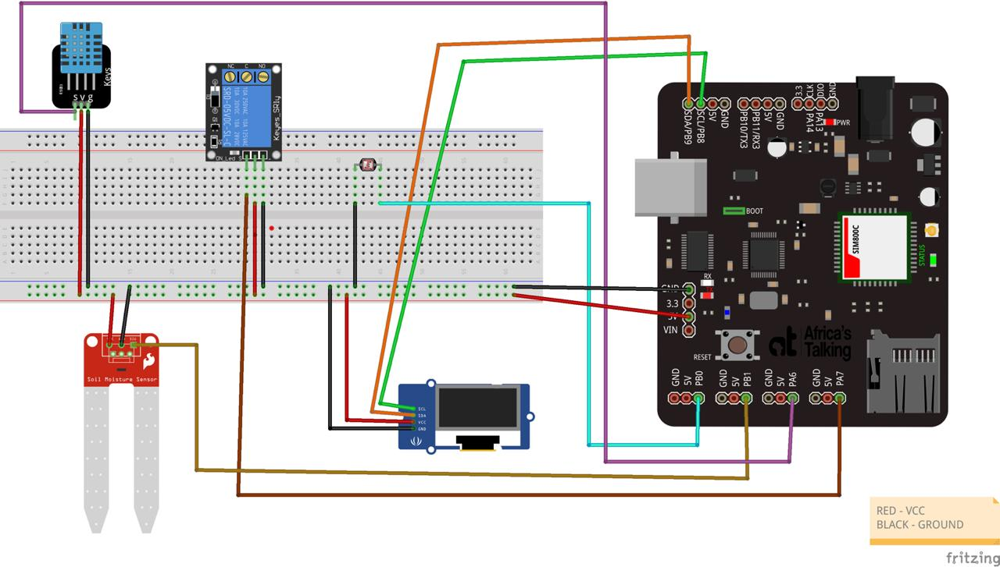
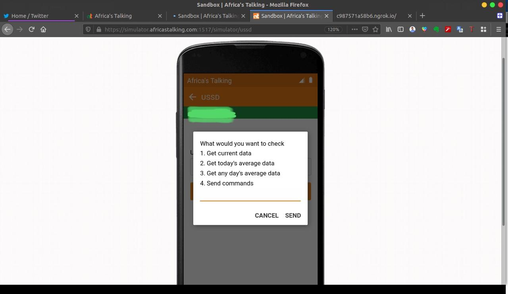
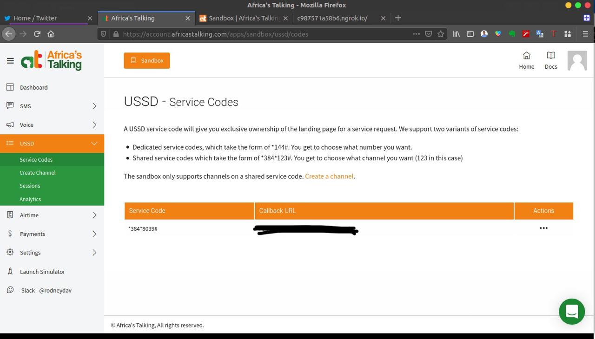
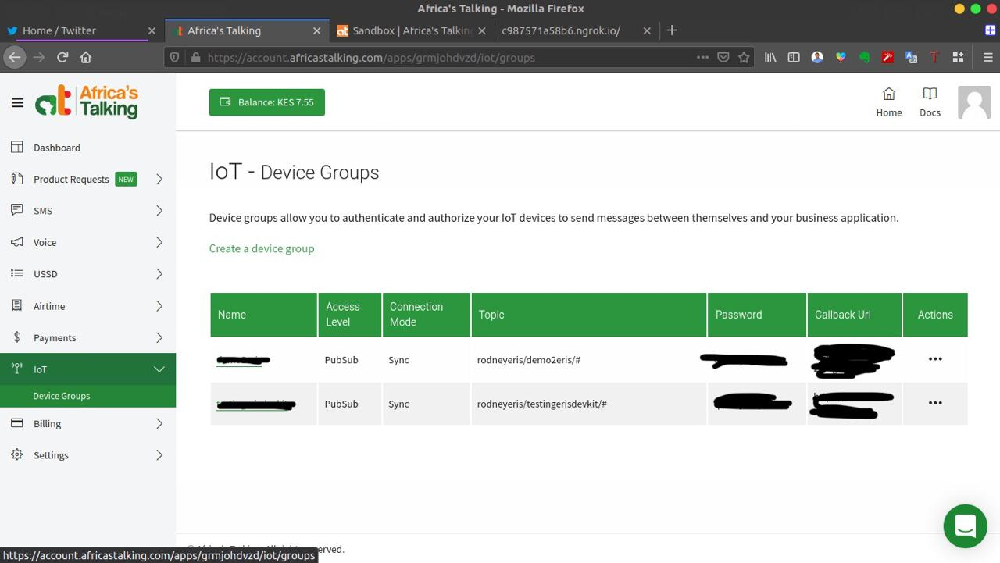
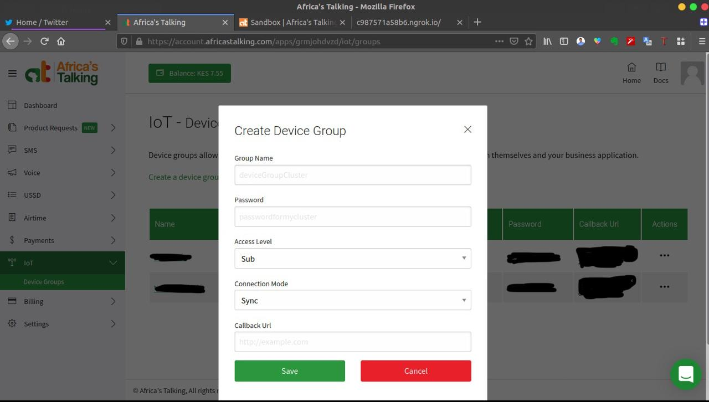
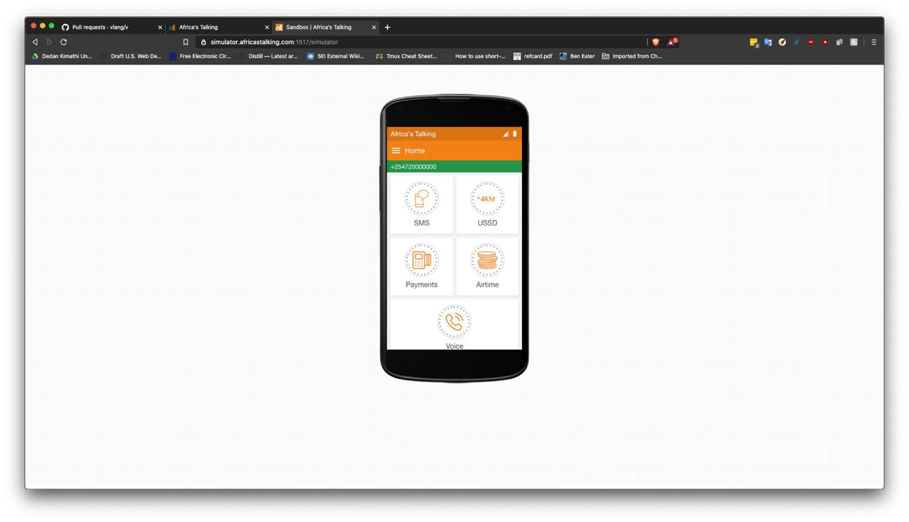
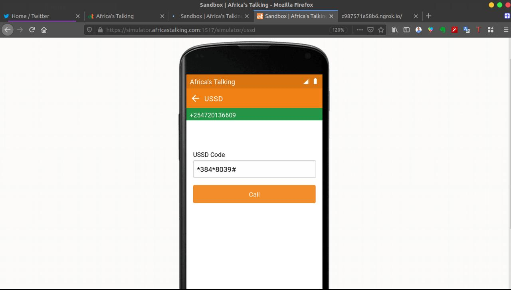
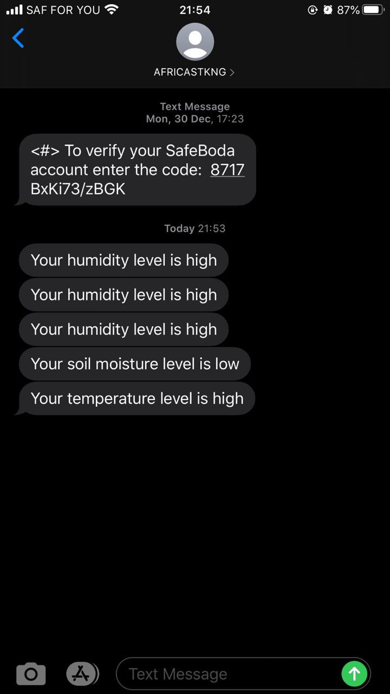
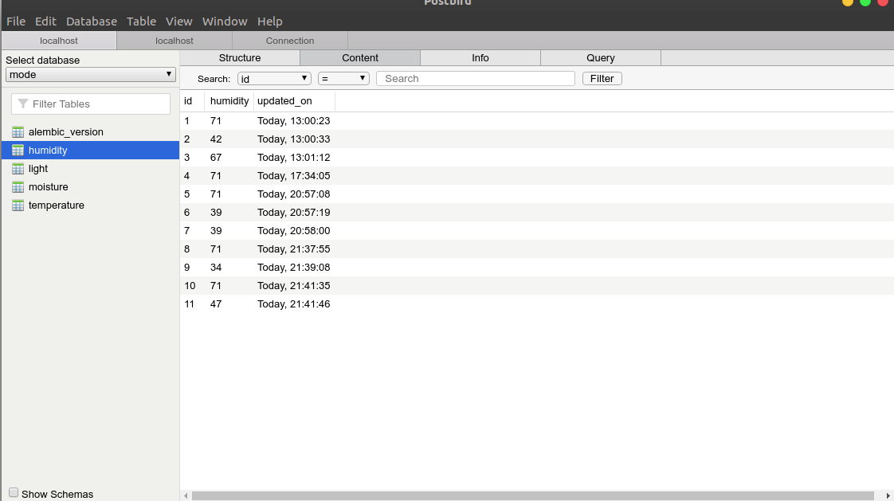
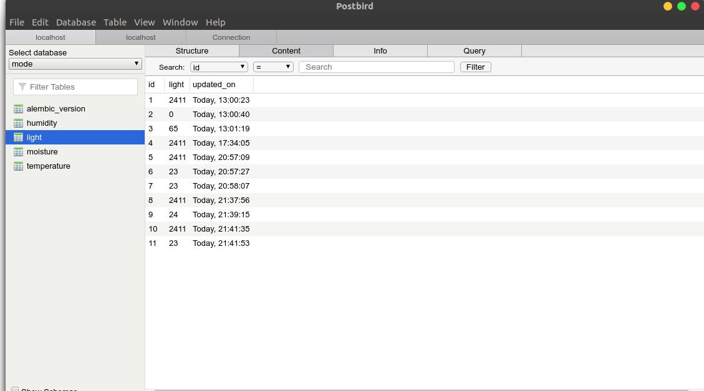

# smart-farm-africastalking-hackathon

This project, smart farm, was demoed at africastalking hackathon for their eris V1 dev kit.

# Introduction

This is a prototype device for smart farming. The smart farm has DHT11 sensor which measures temperature and humidity, a light-dependent resistor that measures the light intensity and a soil moisture sensor that measures soil moisture content. We have an irrigation system and fan system symbolized by a solid-state relay. When the soil moisture is low the eris dev kit automatically starts the irrigation system to raise the soil moisture content. If the soil moisture rises until it reaches a certain level the irrigation system is closed. When the temperature is high the fan and irrigation system is turned on to reduce the temperature of the microclimate. If it drops to a certain level the two systems are stopped. When the humidity is low the irrigation system which is overhead the crops is started to raise the humidity to optimum levels. If it is high the irrigation system is stopped. For light intensity, we are tracking the records to be able to make better decisions in the future maybe by data analysis.

The microcontroller generally measures all the parameters after every minute and sends it to africa's talking IoT API. Meanwhile, the date is also shown on an OLED screen on the eris dev kit. For sending the data we are using the MQTT protocol and we are sending it via the network of Safaricom. This is to mean that the eris dev kit has a Preconfigured sim card to send data to Africa's Talking API.

## Hardware 

For the hardware, we are using the eris dev kit v1 as our microcontroller.

Things to config:

1. DHT11 sensor
2. Soil moisture sensor
3. Light-dependent resistor
4. Solid-state relay
5. OLED screen

### Wiring

For the wiring, we are connecting the dht11 sensor pin to a digital input, pin PA6, to be able to receive temperature and humidity data. The Soil moisture sensor pin is connected also to a digital input pin, pin PB1. The Light-dependent resistor power pin is connected also to a digital input pin, pin PB0. The solid-state relay is connected to a digital output pin, pin PA7. The OLED screen is connected via the Inter-Integrated Circuit, or I2C on pin PB8 and PB9 for SCL and SDA respectively.

* SDA (Serial Data) – The line for the master and slave to send and receive data.
* SCL (Serial Clock) – The line that carries the clock signal.

I2C is a serial communication protocol, so data is transferred bit by bit along a single wire (the SDA line). I2C is synchronous, so the output of bits is synchronized to the sampling of bits by a clock signal shared between the master and the slave. The clock signal is always controlled by the master.



### Hardware App

We will look at some of the key points to take home. Other can be found at the GitHub repository [here](https://github.com/0x6f736f646f/smart-farm-africastalking-hackathon/tree/master/Hardware/harwareapp)

Before we start anything we need to define our apn to be able to connect to Safaricom before pushing data to the africastalking MQTT server.

``` cpp
// Your GPRS credentials, if any
const char apn[] = "iot.safaricom.com";
const char gprsUser[] = "";
const char gprsPass[] = "";
// Buffer to stop messages when formating before publishing or printing
char buffer[100];
// Default return code
int returnCode = 0;
```

We also need to config our MQTT to be able to push data to it. We need an MQTT username, password. With africastalking we also need the device id to be able to identify your device and also the respective MQTT topics to which we will publish and subscribe to.

``` cpp
// BEGIN MQTT CONFIG
const char mqttUsername[] = MQTT_CREDENTIALS;
const char mqttPassword[] = DEVICE_GROUP_PASSWORD;
const char mqttDeviceID[] = DEVICE_ID;

// birth topic - This is a topic that the device publishes when it makes the first MQTT Connection
//  will topic - This is a topic that the device should publish when it disconnects.

const char *birthTopic = TOPIC_PREFIX "birth";
const char *willTopic = TOPIC_PREFIX "will";
const char *humidityTopic = TOPIC_PREFIX "humidity";
const char *soilMoistureTopic = TOPIC_PREFIX "moisture";
const char *temperatureTopic = TOPIC_PREFIX "temperature";
const char *relayTopic = TOPIC_PREFIX "relay";
const char *lightIntensityTopic = TOPIC_PREFIX "light";

const char birthMessage[] = "CONNECTED";
const char willMessage[] = "DISCONNECTED";

char brokerAddress[] = BROKER_ADDRESS;
int brokerPort = BROKER_PORT;
// END MQTT CONFIG
```

All the functions we will be using are defined here.

``` cpp
// DECLARATION OF FUNCTIONS
float readTemp(void);
float readHum(void);
float readSoilMoisture(void);
float readLightIntensity(void);
void connectGSM(void);
void connectMqtt(void);
void publishMessage(char *payload, const char *topic);
void sendTemperature(void);
void sendHumidity(void);
void sendSoilMoisture(void);
void sendLightIntensity(void);
void incomingMessageHandler(MQTT::MessageData &messageData);
void pre(void);
void print_on_oled(char* topic, float data);
```

An example of reading humidity data from the DHT11 sensor is outlined here. We use the DHT library to be able to get humidity data from it.

``` cpp
float readHum(void)
{
    // This functions reads the humidity as returns the value as float
    humidity = dht.readHumidity();
    // Check if reads failed and exit
    if (humidity == NULL){
        Serial.println("Failed to read from DHT");
        exit;
    }
    print_on_oled("Humidity: ", humidity);
    return humidity;
}
```

We need to connect to the Safaricom GSM endpoint since our sim card is Safaricom based. After connecting to GSM we will be able to now use the sim card features e.g using the internet to push data to africastalking MQTT server.

``` cpp
void connectGSM(void)
{
    // This function connects to GSM
    SerialMon.println("Getting the modem ready");
    modem.init();
    String name = modem.getModemName();
    String modemInfo = modem.getModemInfo();
    SerialMon.print("Name: ");
    SerialMon.println(name);
    SerialMon.print("Modem info: ");
    SerialMon.println(modemInfo);
    SerialMon.println("Initializing GSM network registration");
    if (!modem.waitForNetwork())
    {
        SerialMon.println("Unable to initialize registration. Reset and try again.");
        // Restart takes quite some time To skip it, call init() instead of restart()
        modem.restart();
        while (true)
        {
            ;
        }
    }
    if (modem.isNetworkConnected()) {
        SerialMon.println("Network connected");
        pre();
        u8x8.setFont(u8x8_font_amstrad_cpc_extended_f);
        u8x8.setCursor(0,4); 
        u8x8.print("Network: ");
        u8x8.setCursor(0,5); 
        u8x8.print("connected");
    }
    SerialMon.println("GSM OK");
    // GPRS connection parameters are usually set after network registration
    SerialMon.println("Attempting to establish GPRS connection");
    if (!modem.gprsConnect(apn, gprsUser, gprsPass))
    {
        SerialMon.println("Unable to connect to APN. Reset and try again");
        while (true)
        {
            ;
        }
    }
    if(modem.isGprsConnected())
    {
        SerialMon.println("GPRS status: connected" );
            pre();
            u8x8.setFont(u8x8_font_amstrad_cpc_extended_f); 
            u8x8.setCursor(0,4);
            u8x8.print("GPRS: ");
            u8x8.setCursor(0,5); 
            u8x8.print("connected");
    }

    String ccid = modem.getSimCCID();
    SerialMon.print("CCID: ");
    SerialMon.println(ccid);

    String imei = modem.getIMEI();
    SerialMon.print("IMEI: ");
    SerialMon.println(imei);

    String imsi = modem.getIMSI();
    SerialMon.print("IMSI: ");
    SerialMon.println(imsi);

    String cop = modem.getOperator();
    SerialMon.print("Operator: ");
    SerialMon.println(cop);

    IPAddress local = modem.localIP();
    SerialMon.print("Local IP: ");
    SerialMon.println(local);

    int csq = modem.getSignalQuality();
    SerialMon.print("Signal quality: ");
    SerialMon.println(csq);
}

```

We also need to connect to our MQTT server to publish and subscribe to topics.

``` cpp
void connectMqtt(void)
{
    // Connects to MQTT
    MQTT::Message mqttMessage;
    snprintf(buffer, sizeof(buffer), "Connecting to %s on port %u\n", brokerAddress, brokerPort);
    SerialMon.println(buffer);
    returnCode = ipstack.connect(brokerAddress, brokerPort);
    if (returnCode != 1)
    {
        SerialMon.println("Unable to connect to TCP Port.");
    }
    else
    {
        SerialMon.println("TCP port open");
    }
    delay(delay_time);
    MQTTPacket_connectData data = MQTTPacket_connectData_initializer;
    data.MQTTVersion = 4;
    data.clientID.cstring = (char *)mqttDeviceID;
    data.username.cstring = (char *)mqttUsername;
    data.password.cstring = (char *)mqttPassword;
    data.keepAliveInterval = 60;
    data.cleansession = 1;
    data.will.message.cstring = (char *)willMessage;
    data.will.qos = MQTT::QOS1;
    data.will.retained = 0;
    data.will.topicName.cstring = (char *)willTopic;
    returnCode = mqttClient.connect(data);
    if (returnCode != 0)
    {
        snprintf(buffer, sizeof(buffer), "Code %i. Unable to contact the broker. Is it up? Reset and try again \r\n", returnCode);
        SerialMon.print(buffer);
        while (true)
        {
            ;
        }
    }
    mqttMessage.qos = MQTT::QOS1;
    mqttMessage.retained = false;
    mqttMessage.dup = false;
    mqttMessage.payload = (void *)birthMessage;
    mqttMessage.payloadlen = strlen(birthMessage) + 1;
    returnCode = mqttClient.publish(birthTopic, mqttMessage);
    snprintf(buffer, sizeof(buffer), "Birth topic publish return code %i \n", returnCode);
    SerialMon.println(buffer);
    returnCode = mqttClient.subscribe(relayTopic, MQTT::QOS1, incomingMessageHandler);
    if (returnCode != 0)
    {
        snprintf(buffer, sizeof(buffer), "Unable to subscribe to relay topic \n");
        SerialMon.print(buffer);
        while (true)
        {
            ;
        }
    }
    SerialMon.println("Successfully connected to the broker");
    pre();
    u8x8.setFont(u8x8_font_amstrad_cpc_extended_f); 
    u8x8.setCursor(0,4);
    u8x8.print("Broker: ");
    u8x8.setCursor(0,5); 
    u8x8.print("connected");
}
```

Since we will be publishing messages to the topics our function takes in the data your want to publish and the topic you want to publish to it.

``` cpp
void publishMessage(char *payload, const char *topic)
{
    // Publishes messages to the broker
    MQTT::Message message;
    message.qos = MQTT::QOS1;
    message.payload = (void *)payload;
    message.payloadlen = strlen(payload) + 1;
    returnCode = mqttClient.publish(topic, message);
    snprintf(buffer, sizeof(buffer), "%s topic publish return code %i", topic, returnCode);
    SerialMon.println(buffer);
}

```

To send data to our MQTT broker we use this function. This is an example of sending humidity data to our africastalking endpoint.

``` cpp
void sendHumidity(void)
{
    // Sends humidity data to the broker
    humidity = readHum();
    snprintf(buffer, sizeof(buffer), "%.3f", humidity);
    publishMessage(buffer, humidityTopic);
}
```

To handle all our incoming data we use this function. It checks if the incoming message is saying `on` or `off` . This is to start and stop our relay since it is used as our irrigation system

``` cpp
void incomingMessageHandler(MQTT::MessageData &messageData)
{
    // Handler for incoming messages
    MQTT::Message &message = messageData.message;
    MQTTString topic = messageData.topicName;
    snprintf(buffer, sizeof(buffer), "%s", messageData.topicName);
    if (buffer == relayTopic)
    {
        snprintf(buffer, sizeof(buffer), "%s", messageData.message.payload);
        if (buffer == "on")
        {
            digitalWrite(relayPin, 1);
        }
        else if (buffer == "off")
        {
            digitalWrite(relayPin, 0);
        }
        else
        {
            SerialMon.print("Unknown LED Command: ");
            SerialMon.println(buffer);
        }
    }
    else
    {
        SerialMon.print("Unknown Topic: ");
        SerialMon.println(buffer);
    }
}

```

This function prints the topic and data to the OLED screen

``` cpp
void print_on_oled(char* topic, float data)
{
    // prints data on oled screen
    sprintf(buffer, "%.2f", data);
    SerialMon.print(topic);
    SerialMon.println(buffer);
    pre();
    u8x8.setFont(u8x8_font_amstrad_cpc_extended_f); 
    u8x8.drawString(0, 2, topic);
    u8x8.draw2x2String(0, 5, buffer);
}
```

The Arduino sketch can be found at [here](https://github.com/0x6f736f646f/smart-farm-africastalking-hackathon/tree/master/Hardware/harwareapp)

## Backend App

This is the callback applications that listen to all the incoming and is also responsible for outgoing messages. This application has USSD and SMS services for farming. In the future, I will implement a voice application. The USSD app is responsible for displaying the data of the farm to the user. It has a wide range of use cases spanning from getting data from any date to starting or stoping irrigation. The SMS service sends a daily average at the end of the day and also sends alert on any extreme conditions.

## Usage

Play the [youtube](https://youtu.be/OunLw0YObY4) video

[](https://youtu.be/OunLw0YObY4)

### Build the Arduino file

### Third-Party Libraries

| Library              | Function                            | Source                                                                                     |
| -------------------- | ----------------------------------- | ------------------------------------------------------------------------------------------ |
| MQTT Client(Eclipse) | Handling MQTT Client Connection     | [Eclipse.org](https://www.eclipse.org/downloads/download.php?file=/paho/arduino_1.0.0.zip) |
| Tiny GSM             | Handling GSM Module connection      | [TinyGSM](https://github.com/vshymanskyy/TinyGSM)                                          |
| DHT                  | High level wrapper for DHT sensors  | [Adafruit](https://github.com/adafruit/DHT-sensor-library)                                 |
| U8x8lib              | High level wrapper for OLED display | [olikraus/u8g2](https://github.com/olikraus/u8g2)                                          |

1. Go to `Hardware/hardwareapp` then create a `config.h` file. This will hold you config Variables
2. Inside the `config.h` add

```c++
// This is your application username that is associated with your IoT Appplication
#define APPLICATION_USERNAME "rodneydemo" 
// This is the device group that the IoT device is to connect to 
#define DEVICE_GROUP_NAME "rodneygroup"
// This is the device identifier that is sent to the Africa's Talking Broker
#define DEVICE_ID "rodneykit"
// This is the devive group password that the IoT device is to use to establish a connection
#define DEVICE_GROUP_PASSWORD "$#numbayasiri$%^&*("
// This will resolve to <username>:<device-group>
#define MQTT_CREDENTIALS APPLICATION_USERNAME ":" DEVICE_GROUP_NAME
// This will always start with <username>/<device-group>/
#define TOPIC_PREFIX APPLICATION_USERNAME "/" DEVICE_GROUP_NAME "/"
// Safaricom APN
#define SAF_APN "iot.safaricom.com"
// Africa's Talking broker url
#define BROKER_ADDRESS "broker.africastalking.com"
// Africa's Talking broker port
#define BROKER_PORT 1883

``` 

3. Reset the board the build

### Setup callback

Have to Make docker and ngrok installed

1. Create a `broker.env` file with the following configs

```python
MQTT_HOST = "broker.africastalking.com"
MQTT_PORT = 1883
MQTT_USERNAME = "rodneydemo:athackathon"
MQTT_PASSWORD = "$#numbayasiri$%^&*("
CLIENT_ID = "rodneyclient"
FARMER_NUMBER = "+2547XXXXXXXX"
AT_PASSWORD = "XXXXXXXXXXXXXXXXXXXXXXXXXXXXXXXXXXXXXX"
AT_USERNAME = "rodneyXXXXX"
```

2. Start Postgres database as a docker container

``` shell
make start-postgres
```

This starts a docker Postgres server in your local machine at port `1001`

3. Install requirements

``` shell
pip3 install -r requirements.txt
```

This installs also your backend app requirements need for this to run.

4. Export configs

``` shell
make export-config
```

This exports your database URI and hardware app configs

5. initialize flask app

``` shell
make initialize-app
```

This initializes your database, migrates it then upgrades it before running your server.

6. Run ngrok

``` shell
make start-ngrok
```

This is to expose your backend callback app to the internet.

7. Copy your callback url you will use it later

### Setup Africa's Talking Account 

#### USSD (Sandbox) 

1. In your Sandbox account, navigate to the USSD blade and click on "Create Channel"

 


 

2. In the channel creation form, add a USSD shortcode number, and in the callback URL field add your app URL and append `ussd`. For example, if your Heroku app url in 4 above is `https://mycoolapp.herokuapp.com/` then your USSD callback should be `https://mycoolapp.herokuapp.com/ussd`. 



 

3. Save and in the end, you should have something like shown above



 

#### IoT (Live) 

1. Inside your AT IoT account, Click on the `...` under the `Actions` tab for the device group you'd like to configure the callback for and update the callback URL to `iot`. For example, if your Heroku app url above is `https://mycoolapp.herokuapp.com/` then your IoT callback should be `https://mycoolapp.herokuapp.com/iot`. 



 

#### The Simulator (Sandbox) 

1. Navigate to the [AT Sandbox Simulator page](https://simulator.africastalking.com:1517/). Enter a valid phone number.

2. Click on the USSD option



3. Dial your USSD code. If your shortcode above was 1000, enter `*384*1000#` and press the `Call` button for magic!



4. [Demo](https://youtu.be/OunLw0YObY4) is 


6. SMS Alerts 



7. Data in my database:

   1. 



   2. 



   3. 


   
